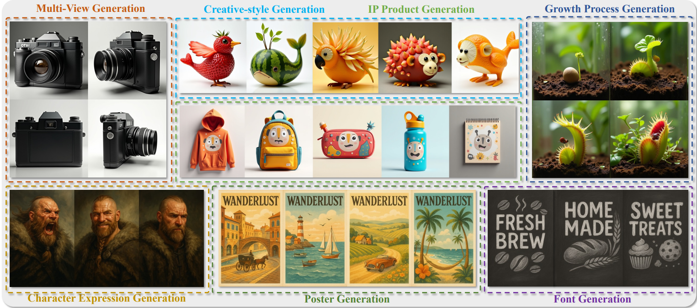

<h1 align="center">
Why Settle for One? Text-to-ImageSet Generation and Evaluation
</h1>
<p align="center">
  <a href="https://chengyou-jia.github.io/T2IS-Home/"><b>[🌐 Website]</b></a> •
  <a href="https://arxiv.org/abs/2506.23275"><b>[📜 Paper]</b></a> •
  <a href="https://huggingface.co/datasets/ChengyouJia/T2IS-Bench"><b>[🤗 HF Dataset]</b></a> •  
</p>


<p align="center">
Official Repo for "<a href="https://arxiv.org/abs/2506.23275" target="_blank">Why Settle for One?
Text-to-ImageSet Generation and Evaluation</a>"
</p>

> **🚀 Code for evaluation and generation will be released soon. Stay tuned!**  
> We are working hard to make the code available. Watch this repo for updates!

## ChatGen



##  News

- _2025.07_:  We release the details of <a href="https://huggingface.co/datasets/ChengyouJia/T2IS-Bench"><b>[T2IS-Bench]</b></a>.


## Citation
If you find it helpful, please kindly cite the paper.
```
@article{jia2025settle,
  title={Why Settle for One? Text-to-ImageSet Generation and Evaluation},
  author={Jia, Chengyou and Shen, Xin and Dang, Zhuohang and Xia, Changliang and Wu, Weijia and Zhang, Xinyu and Qian, Hangwei and Tsang, Ivor W and Luo, Minnan},
  journal={arXiv preprint arXiv:2506.23275},
  year={2025}
}
```

## 📬 Contact

If you have any inquiries, suggestions, or wish to contact us for any reason, we warmly invite you to email us at cp3jia@stu.xjtu.edu.cn.
